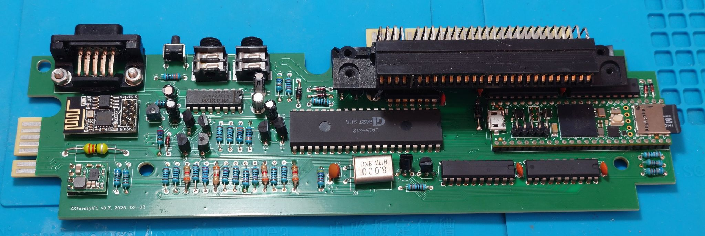
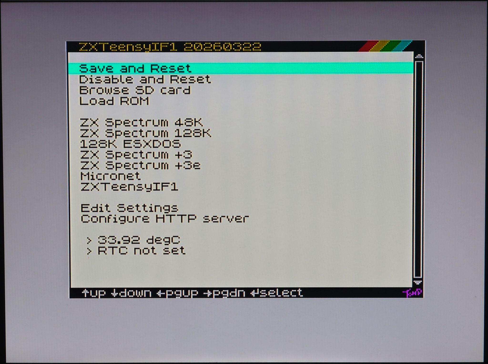

# ZXTeensyIF1

A Teensy 4.1 powered DivMMC and ZX Interface 1 clone for the ZX Spectrum 48K/128K/+2 (Grey) machines,

* ZX Interface 1
    * Requires the 9V and 5V power rails
    * Uses a MAX232 for the RS232 level shifting, so no +12V or -12V required
    * Supports 16KB shadow soft ROM
* DivMMC with 512KB RAM
    * Supports accessing the main SD card, HDF and IMG images
* Multiface 128 emulation
    * NMI button and soft ROM
* ZX Interface 2 ROM cartridge emulation
    * It does not emulate the Joystick ports
* ZXC2 and ZXC3 with Flash ROM cartridge emulation
    * Implements ZXC2 ROM banking
    * Implements ZXC3 ROM banking with 128KB Flash ROM
    * Implements SPECTRA shadow ROM support
        * The ROM file needs to be named as "SPECTRA_\*.bin"
* ESP-01S module via TX8/RX8
    * Requires the 9V power rail for the 3.3V regulator
    * Available on ports 0x143B (5179) for RX and 0x133B (4923) for TX
    * https://www.specnext.com/the-next-on-the-network/
* USB mouse and gamepad Kempston interface
    * Not wired to the board - use a small lead that exits the case
    * eg. StarTech.com "6in USB 2.0 Cable - USB A Female to USB Motherboard 4 Pin Header F/F"
* RTC module from the Teensy
    * Accessed as a RTC-72421 on ports 0x7X3B
        * The time is only read or written when register 0xD sets HOLD to 1
    * Uses a minor bugfixed RTC.SYS from https://velesoft.speccy.cz/zx/rtcmodule/index.htm
        * Patched byte 6 from 0x0D to 0x7D
    * Not wired to the board - attach a coin cell battery to VBAT
        * See https://www.pjrc.com/store/teensy41.html#timing
* Single speed TZX and TAP playback
    * Playback locks the keyboard, as it overdrives the ULA
    * TAP loading is better done via the DivMMC
* Spectrum +3 uPD765a FDC emulation
    * Integrated lib765 v0.4.2 with additional bug fixes for "EXTENDED" disk loading
    * Requires Spectrum +2A/+3 soft ROM support (see below), or other compatible DOS
* Prism VTX5000 over ESP-01S
    * Creates a serial tunnel over WiFi to given URL
    * Default URL is '"glasstty.com",6502' - https://glasstty.com/telstar/
* Spectrum +3 and ZX LPRINT III Centronics printer
    * Writes output into a "printer.txt" file on SD card
* Soft ROM emulation
    * Override the internal Spectrum ROM with ROMs from SD card
    * Supports 16KB (Spectrum 48K), 32KB (Spectrum 128K/+2 (Grey)) and 64KB (Spectrum +2A/+3) ROMs
        * The +2A/+3 soft ROM support requires port decoding changes (see below)
    * Provides the Interface 1 ROM, Multiface 128 ROM and DivMMC ROM
* Menu ROM derived from TomDDGs ZXPicoIF2Lite ROMExplorer
* Z80 snapshot loading from TomDDGs ZXPicoIF2Lite
    * Integrated "z80torom" for loading 'z80' and 'sna' files
* Save and restore states
    * Uses the Z80 snapshot loader to restore state on power-on
    * Hold the button to disable the power-on restore
* MDR microdrive loading with Paul Farrows SPECTRA Microdrive Emulator
    * http://www.fruitcake.plus.com/Sinclair/Interface2/Cartridges/Interface2_RC_New_Microdrive_Emulator.htm
    * Supports MDR images with up to 90KB of data
* Small WebDAV class 1 HTTP server for WiFi file access over ESP-01S
    * Use WinSCP to send files, or HTTP PUT to send files eg. "curl -T FILENAME.ROM http://192.168.0.254/FILENAME.ROM"
        * Windows native support requires LOCK (and UNLOCK) which is Not Implemented
    * Use web browser to list files, and download
* Nihirash's Network Manager for WiFi configuration
    * Small bugfix to clear the BASIC keypress on load
* Velesoft's RTC_SETUP for RTC configuration
    * Minor tweaks to preset the RTC port
* External ROM support
    * ZX Interface 1 edge connector supports other ROM based hardware
    * eg. Retroleum SMART card, real ZX Interface 2 hardware etc.

The ZX Interface 1 v2 ROM is included in compiled firmware, and as noted on other
sources "Amstrad have kindly given their permission for the redistribution
of their copyrighted material but retain that copyright"

This is a project that I started with a view of wanting a DivMMC clone that works with a
ZX Interface 1 attached to my ZX Max 128 - as I own a ZX Microdrive as well as a ZXPicoMD
(https://github.com/TomDDG/ZXPicoMD) ... and didn't want to keep disconnecting the ZX
Interface 1.

> [!WARNING]
> I created this for myself, and it is distributed in the hope that it will be useful,
> but WITHOUT ANY WARRANTY; without even the implied warranty of MERCHANTABILITY or
> FITNESS FOR A PARTICULAR PURPOSE.
>
> I take ZERO responsibility if it damages your hardware!

## Credits

Full credits to the following projects - this project gathers and integrates from
many various sources.

It borrows content, ideas and inspiration from,

* http://www.pjrc.com/teensy/
    * Teensyduino Core and SdFat libraries - provides all the Teensy 4.1 functionality
    * Reused parts of code for the RTC, SDHC and UART drivers
* https://github.com/SensoriumEmbedded/TeensyROM
    * Initial code and parts for the Teensy 4.1 firmware
* https://github.com/TomDDG/ZXPicoIF2Lite
    * ROM menu source code, Z80 snapshot loader, and the idea of a soft ROM
* http://www.fruitcake.plus.com/Sinclair/Interface2/Cartridges/Interface2_RC_Cartridges.htm
    * ZXC2 and ZXC3 banking, and Microdrive Emulator
* https://github.com/nihirash/netman-zx
    * WiFi Network Manager for the ESP-01S
* https://velesoft.speccy.cz/zx/rtcmodule/index.htm
    * RTC_SETUP for the RTC module
    * RTC.SYS for EsxDOS
* https://www.seasip.info/Unix/LibDsk/
    * lib765 FDC controller library
* https://github.com/joepasquariello/FlasherX
    * Teensy 4.x OTA upgrade library
* https://github.com/liveboxandy/ZX-Interface-1-Recreated
    * Re-used the ZX Interface 1 board layout and schematic
* https://github.com/ZXSpectrumVault/rom-disassemblies
    * ZX Interface 1 v2 ROM disassembly
* https://spectrumcomputing.co.uk/pub/sinclair/technical-docs/ZXInterface1_Schematics.gif
    * ZX Interface 1 schematic
* https://spectrumcomputing.co.uk/pub/sinclair/technical-docs/PrismVTX5000Modem_Schematics-Interface.bmp
    * Prism VTX5000 schematic
* https://zxpress.ru/chapters_images/periferiya/periferiya-33.png
    * ZX LPRINT III schematic
* https://divide.speccy.cz/files/pgm_model.txt
    * DivIDE programming model
* https://www.thingiverse.com/thing:6500064
    * Also from TomDDG, a replacement ZX Interface 1 case

Without the above projects, this would not have been possible!

## Current Status

Updated v0.7 PCBs have come back from PCBWay, and appear to be working. Now, spending time
on implementing the firmware features...

The first v0.2 PCBs had come back from PCBWay, and been tested with my 48K Spectrum, and my
ZX Max 128 Issue 3. Some parts have come from a donor ZX Interface 1 that needed a new old-stock
LA15-312 ULA from eBay.

Removing the ZX Interface 1 edge connector that goes to the ZX Spectrum was an immense pain - so
might have to find other ideas. Even with gentle heat, I managed to deform and melt the plastic
riser block...

Otherwise, the soft ROM functions correctly - banking the DivMMC, Multiface 128, Interface 1 or
Spectrum soft ROMs as required. eg. when testing the external ROM support, the Retroleum SMART card
(https://blog.retroleum.co.uk/smart-card-for-zx-spectrum/) diagnostics correctly sees the 128K soft
ROM loaded on to my 48K Spectrum.

When the DivMMC is enabled, restarting the machine with ".128" (even on 48K Spectrums) will disable
the DivMMC and enable the Interface 1.

## SD Card Setup

* ZXTEENSY/
    * CONFIGS/
        * \<NAME\>.CFG (Saved configurations that appear as "NAME" in the Menu ROM for quick selection)
    * STATE/\<SLOT\>/ (Save slots 0-14; slot 15 is reserved)
        * STATE.Z80 (Z80 v3 snapshot for the save state)
        * SCREEN.SCR (6912-byte active Spectrum screen for load preview)
        * (Additional saved state files for the save slot)
    * MENU.ROM
    * MF128.ROM (MD5SUM: ca8c9d97c8aedd718d1081fad2e3af8d)
    * ESXMMC.BIN (MD5SUM: fa50b0258e52b8d72bd83cc2fb6e1013)
    * SPECTRA_IF1_ED2_ME_ROM_Formatted.bin (MD5SUM: 052ad91ee822604960e8ca8d32a3ddb9)
    * IF1.ROM (Optional, MD5SUM: 31b704ae925305e74f50699271fddd9a)
    * VTX.ROM (MD5SUM: 12a62cb7ea7383f109c2711dfca99f5e)
    * LPRINT32.ROM (MD5SUM: e85f4ccb4cc80aaa81cceffb3e064bf7)
    * netman.z80 (WiFi Network Manager snapshot)
    * rtc_setup.z80 (RTC Setup snapshot)
    * ZXTEENSY.CFG (Current configuration from Menu ROM)
* ROMS/
    * (ZX Spectrum ROMs ending ".rom")
    * (ZXC2 ROMs ending ".bin")
    * (Other ROM files)
* (Other ESXDOS files)
* SYS/
    * RTC.SYS (Optional, for RTC access)
    * (Other ESXDOS files)
* ZXTEENSY.HEX (Optional, firmware update)

## Using the Menu ROM

To load the Menu ROM, either,

* Use "Boot into Menu" to load on initial power on
* or, Hold the button, and Reset
* or, Hold Reset for longer than 5 seconds

Inside the Menu ROM you can,

* Restart with either the ZXTeensyIF1 enabled or disabled
    * Pressing Reset will also reset with the ZXTeensyIF1 enabled
* Browse the SD card to select files to load, or mount
    * Selecting known file extensions will either load or ask to mount
    * Selecting unknown file extensions will ask for an action
    * From the in-game browser, select a POK file and tick one or more trainers
      before selecting "Apply selected trainers"
* Browse the system Soft ROMs in the "ROMS/" directory to load, or set as Soft ROM
    * Double selecting a system Soft ROM will immediately reset into it
* Select a saved configuration to load
    * Double selecting a saved configuration will immediately reset into it
* Edit the configuration
    * Enable or disable the peripherals
    * Eject mounted disks by selecting them
    * Set to fetch time over the WiFI, and set the timezone
    * Load the RTC Setup or WiFi Network Manager snapshots
* Start or stop the HTTP server to transfer files over WiFi

To firmware update, place the ZXTEENSY.HEX file on the root of the SD card and
select the option from the Menu ROM - then wait for the Spectrum to reset
(!! It will take a minute !!).

In "Load ROMS", from the "ROMS/" directory,

| File extension | File type |
|----------------|-----------|
| .rom | System Soft ROM |
| .bin | ZXC2 cartridge |
| Other | ZX Interface 2 cartridge |

In "Browse SD card", in other directories,

| File extension | File type |
|----------------|-----------|
| .rom | ZX Interface 2 cartridge |
| .bin | ZXC2 or ZXC3 flash cartridge |
| .z80, .sna | Z80 snapshot |
| .hdf, .img | DivMMC SD card |
| .dsk | Spectrum +3 disk |
| .mdr | ZX Microdrive cartridge |
| .tap, .tzx | Audio cassette |
| .pok | POK trainers (in-game browser only) |
| Other | The menu will ask for an action |

POK trainers are applied by saving a temporary state to reserved slot 15,
patching the selected RAM banks, and immediately restoring that state. POK
trainers that require a prompted value (`256`) are not supported and cannot be
enabled.

### Preparing the SD Card

ESXDOS has trouble loading if it is not "early" on the SD card,

* Format the SD card with FAT32
* Extract ESXDOS on computer, and transfer all directories and ESXMMC.BIN to the SD card
* Transfer the "/ZXTEENSY" directory, with ROMs and CONFIGS
* Create system "/ROMS" directory, and add other ROMs
* Add any other files

## Version History

### Hardware

* v0.7 PCB prototype
    * PCBs have been returned from PCBWay
    * Moved the ROMCS and DataDir output to pins 36 and 37, to free up pins 34 and 35
    * Added an ESP-01S header, and header for 3.3V regulator (eg. Pololu D24V5F3)
        * The ESP-01S can take over 300mA, so requires a separate regulator
        * The Pololu D24V5F3 is a 3.3V 500mA regulator module, available from The Pi Hut
        * I had to re-organise the left side of the board to make room
    * Connected RX8 pin 34 and TX8 pin 35, to the ESP-01S header
* v0.2 PCB prototype
    * First PCBs made, and tested
        * Microdrive, RS232, ZX Net and nROMCS on external edge connector working
        * Firmware updated for new pin layout - soft ROM all working
    * Need to revise some footprints
    * The PCBs had silkscreen that stated v0.1
* v0.1 veroboard prototype (not uploaded)
    * Prototype to test the initial idea
    * Teensy 4.1 and level shifters on Veroboard
        * Soft ROM and Multiface 128 behaviour working
    * Modded ZX Interface 1 to add "nIORQ inhibit" (see below)

## Building the firmware

* Setup the Arduino IDE 2.3.6 for the Teensy 4.1
    * "Teensy (for Arduino IDE 2.0.4 or later)" v1.60.0
* Open ZXTeensyIF1\ZXTeensyIF1.ino
* Set Board to Teensy 4.1
* Set Optimize to "Smallest Code with LTO"
* Set CPU Speed to "816 MHz (overclock)"
* Verify and Upload

## Loading the KiCad project

The PCB folder contains a KiCad 9.0.2 project, based on liveboxandy "ZX Interface 1 Recreated" KiCad
7 project. Without that project, I'd have had to spend considerable time getting the board outline
correct, and aligning the sockets etc.

It uses,

* https://github.com/XenGi/teensy_library as teensy_library-master
* https://github.com/XenGi/teensy.pretty as teensy.pretty-master
    * Set XGENGI_TEENSY_LIBRARY path in Symbol Libraries etc.
* https://github.com/sparkfun/SparkFun-KiCad-Libraries
    * Set SPARKFUN_KICAD_LIBRARY path in Symbol Libraries etc.
* https://github.com/nosuz/kicad-symbols-footprints
    * Place as ./nosuz-kicad-symbols-footprints in the project directory

Freerouting (https://github.com/freerouting/freerouting) was used to perform the initial routing,
especially with getting the address and data lines out to the level shifters and the Interface 1
ULA.

## Prism VTX5000 support

The VTX5000 over ESP-01S uses the ESP8266 in UART-WiFi passthrough mode after establishing
a connection to a URL over TCP. If the VTX.ROM is provided, then it will load after reset.
The default URL is the TELSTAR Viewdata service at https://glasstty.com/telstar/ .

To access TELSTAR,
 * Press CAPS SHIFT + ENTER to open the menu
 * Press 0 to "Log ON or OFF"
 * Press 1 for "Manual Log ON"
 * Enter the ID "\*\*\*\*\*\*\*\*\*\*" ie. 10 asterixes
 * Read the welcome message, and press ENTER as the "#" key

To navigate, either press numbers to select items, or enter pages in the form of "*800#" :-
 * SYMBOL SHIFT is the "*" key
 * ENTER is the "#" key

## DivMMC and ZX Interface 1 support

Technically, the DivMMC and ZX Interface 1 cannot be active simultaneously. The DivMMC ports and
ZX Interface 1 I/O ports clash directly. (More info at below)

To overcome this, the Teensy drives the nIORQ of the Interface 1 ULA high when the DivMMC is
active. Also, only A3 and A4 have been wired to the Interface 1 ULA, as required for the port
decoding - which helped with the PCB routing. The Teensy provides all the ROM facilities for
the Interface 1 behaviour.

## +2A/+3 soft ROM on Spectrum 128K/+2 (Grey) machines

Spectrum 128K, +2 (Grey) and similar machines (eg. ZX Max 128 Issue 3) require a modification to
support the +2A/+3 soft ROM.

Without it, accesses to the Secondary Memory Control register (0x1FFD) also affect the original
Memory Control register (0x7FFD) due to the partial decoding. (More info at
https://worldofspectrum.org/faq/reference/128kreference.htm)

### Spectrum 128K/+2 (Grey) Memory Control port decoding

The BANK decoding is performed by a PAL10H8 chip, which can be swapped for a GAL16V8 to apply
the "Unrainer/IN 7FFD" fix - see https://spectrumforeveryone.com/technical/applying-the-unrainerin-7ffd-fix-to-128grey-2-machines/ and
Velesoft https://velesoft.speccy.cz/zx/umbrella/umbrella.htm for the original article and files.

Unrainer fixed GAL16V8s with socket and wire can be bought from the Retroleum shop at
https://retroleum.co.uk/.

But, by adding a "BANK = ... & ZA14" term, then the GAL will support the decoding
required for the +2A/+3 soft ROM.

I've placed the updated files in the GAL folder.

* Remove IC29 (Spectrum 128K) / IC7 (Grey +2) - and replace with a socket
    * *Take care of the orientation of the socket!* (The Grey +2 has it pointing downwards)
* On the underside, add a wire from CPU pin 28 to the GAL socket pin 11
* Program the GAL16V8 with GALNEW2A.JED, and fit into socket
    * Again, taking care with the orientation!

### ZX Max 128 Issue 3 Memory Control port decoding

The modification is shown at
https://github.com/DonSuperfo/ZX-Max-128/blob/main/Issue%203/Modify%20for%20%2B3%20ROM.pdf,

* Replace R12 with a 1N4148 diode, with cathode to U9 pin 9
* Add a 1N4148 diode from U6 pin 12 with cathode to U9 pin 9
* Add a 10K resistor from U9 pin 9 to ground (eg. U8 pin 24)

## 3rd party Xbox One USB gamepads

You will need to find and add the USB PID:VID code for the controller to the USBHost_t36
library.

In the case of my "8BitDo M30 Wired Controller for Xbox One", under Windows 11
Device Manager, it was the "Xbox Peripherals > Xbox Gaming Device" *NOT* the
(virtual) HID device. Right click the device, select Properties, then Details and
select "Hardware IDs" to find it listed as "USB\VID_2DC8&PID_200A&..."

Once found, add the USB PID:VID code to %LOCALAPPDATA%\Arduino15\packages\teensy\hardware\avr\1.60.0\libraries\USBHost_t36\joystick.cpp,
under JoystickController::pid_vid_mapping ,

* 8BitDo M30 Wired Controller for Xbox One :- \{ 0x2dc8, 0x200a, XBOXONE, false \}

## I/O port mapping

The following ports are decoded by the Teensy,

| Port | R/W | Function | Comments |
| ---- | --- | -------- | -------- |
| 0xXX1F | R | Kempston joystick | |
| 0x133B | R | UART status | |
| 0x133B | W | UART TX data | |
| 0x143B | R | UART RX data | |
| 0x143B | W | UART baud register | |
| 0x7N3B | R/W | DivMMC RTC registers 0 - 15 | N is the register address |
| 0xXX3F | R | Multiface 128 page out | Returns bit 7 as the Current Screen |
| 0xXX3F | W | Multiface 128 disable | |
| 0xXX7B | R | LPRINT III page out | Returns status |
| 0xXX7B | W | LPRINT III data with strobe | |
| 0xXX7F | R/W | VTX5000 data | |
| 0xXXBF | R | Multiface 128 page in | Returns bit 7 as the Current Screen |
| 0xXXBF | W | Multiface 128 NMI clear | Menu ROM RAM banking |
| 0xFADF | R | Kempston mouse buttons | |
| 0xFBDF | R | Kempston mouse X axis | |
| 0xFFDF | R | Kempston mouse Y axis | |
| 0xXXE3 | W | DivMMC control register | |
| 0xXXE7 | W | DivMMC SPI select | |
| 0xXXEB | R/W | DivMMC SPI data | Menu ROM read command, write selected option |
| 0xXXFB | R | LPRINT III page in | Returns status |
| 0xXXFB | W | LPRINT III data, clear strobe | |
| 0x0FFD | R | +3 Centronics busy status | |
| 0x0FFD (0b0000XXXX_XXXXXX0X) | W | +3 Centronics data | |
| 0x1FFD (0b0001XXXX_XXXXXX0X) | W | +2A / +3 Secondary Memory Control | ROM paging, +3 FDC motor and +3 Centronics strobe |
| 0x2FFD | R | +3 FDC status register | |
| 0x3FFD | R | +3 FDC data | |
| 0x3FFD (0b0011XXXX_XXXXXX0X) | W | +3 FDC data | |
| 0x7FFD (0b01XXXXXX_XXXXXX0X) | W | 128K Memory Control | Current Screen, and ROM paging |
| 0xXXFE | R | Spectrum ULA | Drives EAR input for tape |
| 0xXXFF | R/W | VTX5000 register | Ignore first write access, controls ROM paging |

The following ports are decoded by the Interface 1 ULA when not inhibited by the Teensy,

| Port | R/W | Function | Comments |
| ---- | --- | -------- | -------- |
| 0xXXE7 (0bXXX00XXX) | R/W | Interface 1 microdrive data | Halts Z80 on read |
| 0xXXEF (0bXXX01XXX) | R/W | Interface 1 control register | |
| 0xXXF7 (0bXXX10XXX) | R/W | Interface 1 RS232/network data | |

## WebDAV class 1 support

The HTTP server only supports a single connection.

Windows 11 seems to still send a LOCK command when sending a file to the server,
though it is not presented in the server Allow list or required by WebDAV class 1.
It then ignores the "501 Not Implemented" or the "405 Method Not Allowed", and
fails to send the file.

WinSCP seems to work fine - you may need to change the preferences to ensure only
a single upload connection.

OpenAI Codex helped to provide the additional WebDAV class 1 implementation over
just the basic HTTP PUT and GET that I'd implemented.
