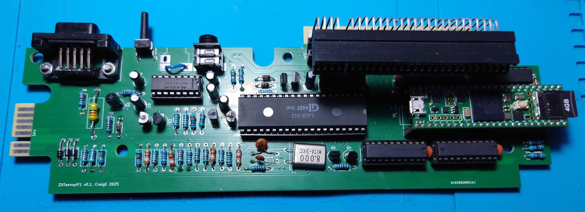

# ZXTeensyIF1

A Teensy 4.1 powered DivMMC and ZX Interface 1 clone for the ZX Spectrum 48K/128K/+2 (Grey) machines,

* ZX Interface 1
    * Requires the 9V and 5V power rails
    * Uses a MAX232 for the RS232 level shifting, so no +12V or -12V required
    * Supports 16KB shadow soft ROM
* DivMMC with 512KB RAM
    * Shares the Teensy main SD card
* Multiface 128 emulation
    * NMI button and soft ROM
* ZX Interface 2, and ZXC2 ROM emulation
    * Implements ZXC2 ROM banking
* ESP-01S module via TX8/RX8
    * Requires the 9V power rail for the 3.3V regulator
    * Available on ports 0x143B (5179) for RX and 0x133B (4923) for TX
    * https://www.specnext.com/the-next-on-the-network/
* Kempston USB mouse and gamepad
    * Not wired to the board - use a small lead that exits the case
    * eg. StarTech.com "6in USB 2.0 Cable - USB A Female to USB Motherboard 4 Pin Header F/F"
* RTC module from the Teensy
    * Accessed as a RTC-72421 on ports 0x7X3B
        * The time is only read or written when register 0xD sets HOLD to 1
    * Uses a minor bugfixed RTC.SYS from https://velesoft.speccy.cz/zx/rtcmodule/index.htm
        * Patched byte 6 from 0x0D to 0x7D
    * Not wired to the board - attach a coin cell battery to VBAT
        * See https://www.pjrc.com/store/teensy41.html#timing
* Soft ROM emulation
    * Override the internal Spectrum ROM with ROMs from SD card
    * Supports 16KB (Spectrum 48K), 32KB (Spectrum 128K/+2 (Grey)) and 64KB (Spectrum +2A/+3) ROMs
        * The +2A/+3 soft ROM support requires port decoding changes (see below)
    * Provides the Interface 1 ROM, Multiface 128 ROM and DivMMC ROM
* Menu ROM derived from TomDDGs ZXPicoIF2Lite ROMExplorer
* Z80 snapshot loading from TomDDGs ZXPicoIF2Lite
    * Integrated "z80torom" for loading 'z80' and 'sna' files
* Nihirash's Network Manager for WiFi configuration
    * Small bugfix to clear the BASIC keypress on load
* Velesoft's RTC_SETUP for RTC configuration
    * Minor tweaks to preset the RTC port
* External ROM support
    * ZX Interface 1 edge connector supports other ROM based hardware
    * eg. Retroleum SMART card, real ZX Interface 2 hardware etc.

The ZX Interface 1 v2 ROM is included in compiled firmware, and as noted on other
sources "Amstrad have kindly given their permission for the redistribution
of their copyrighted material but retain that copyright"

This is a project that I started with a view of wanting a DivMMC clone that works with a
ZX Interface 1 attached to my ZX Max 128 - as I own a ZX Microdrive as well as a ZXPicoMD
(https://github.com/TomDDG/ZXPicoMD) ... and didn't want to keep disconnecting the ZX
Interface 1.

## Credits

Full credits to the following projects - this project gathers and integrates from
many various sources.

It borrows content, ideas and inspiration from,

* http://www.pjrc.com/teensy/
    * Teensyduino Core and SdFat libraries - provides all the Teensy 4.1 functionality
    * Reused parts of code for the RTC, SDHC and UART drivers
* https://github.com/SensoriumEmbedded/TeensyROM
    * Initial code and parts for the Teensy 4.1 firmware
* https://github.com/TomDDG/ZXPicoIF2Lite
    * ROM menu source code, Z80 snapshot loader, and the idea of a soft ROM
* https://github.com/nihirash/netman-zx
    * WiFi Network Manager for the ESP-01S
* https://velesoft.speccy.cz/zx/rtcmodule/index.htm
    * RTC_SETUP for the RTC module
    * RTC.SYS for EsxDOS
* https://github.com/joepasquariello/FlasherX
    * Teensy 4.x OTA upgrade library
* https://github.com/liveboxandy/ZX-Interface-1-Recreated
    * Re-used the ZX Interface 1 board layout and schematic
* https://github.com/ZXSpectrumVault/rom-disassemblies
    * ZX Interface 1 v2 ROM disassembly
* https://spectrumcomputing.co.uk/pub/sinclair/technical-docs/ZXInterface1_Schematics.gif
    * ZX Interface 1 schematic
* https://divide.speccy.cz/files/pgm_model.txt
    * DivIDE programming model
* https://www.thingiverse.com/thing:6500064
    * Also from TomDDG, a replacement ZX Interface 1 case

Without the above projects, this would not have been possible!

## Current Status

Updated v0.7 PCBs have come back from PCBWay, and now being tested.

The first v0.2 PCBs had come back from PCBWay, and been tested with my 48K Spectrum, and my
ZX Max 128 Issue 3. Some parts have come from a donor ZX Interface 1 that needed a new old-stock
LA15-312 ULA from eBay.

Removing the ZX Interface 1 edge connector that goes to the ZX Spectrum was an immense pain - so
might have to find other ideas. Even with gentle heat, I managed to deform and melt the plastic
riser block...

Otherwise, the soft ROM functions correctly - banking the DivMMC, Multiface 128, Interface 1 or
Spectrum soft ROMs as required. eg. when testing the external ROM support, the Retroleum SMART card
(https://blog.retroleum.co.uk/smart-card-for-zx-spectrum/) diagnostics correctly sees the 128K soft
ROM loaded on to my 48K Spectrum.

When the DivMMC is enabled, restarting the machine with ".128" (even on 48K Spectrums) will disable
the DivMMC and enable the Interface 1.

## SD Card Setup

* ROOT/
    * MENU.ROM
    * MF128.ROM (MD5SUM: ca8c9d97c8aedd718d1081fad2e3af8d)
    * ESXMMC.BIN (MD5SUM: fa50b0258e52b8d72bd83cc2fb6e1013)
    * IF1.ROM (Optional, MD5SUM: 31b704ae925305e74f50699271fddd9a)
    * ROMS/
        * (ZX Spectrum ROMs ending ".rom")
        * (Interface 2 and ZXC2 ROMs ending ".bin")
    * (Other ESXDOS files)
    * SYS/
        * RTC.SYS (Optional, for RTC access)
        * (Other ESXDOS files)
    * netman.z80 (WiFi Network Manager snapshot)
    * rtc_setup.z80 (RTC Setup snapshot)
    * ZXTEENSY.CFG (Saved configuration from Menu ROM)
    * ZXTEENSY.HEX (Optional, firmware update)

Hold the button on Reset to load the menu ROM - here, you can toggle the DivMMC, Interface 1 and
Multiface 128 on and off - then selecting a ROM to load will save the preference and load that
ROM next time.

To firmware update, place the file on the SD card and select the option from the Menu ROM -
then wait for the Spectrum to restart (!! It will take a minute !!).

### Preparing the SD Card

ESXDOS has trouble loading if it is not "early" on the SD card,

* Format the SD card with FAT32
* Extract ESXDOS on computer, and transfer all directories and ESXMMC.BIN to the SD card
* Transfer the MF128.ROM, MENU.ROM and ZXTEENSY.CFG
* Create ROMS directory, and add other ROMs
* Add any other files

## Version History

### Hardware

* v0.7 PCB prototype
    * PCBs have been sent for manufacturing
    * Moved the ROMCS and DataDir output to pins 36 and 37, to free up pins 34 and 35
    * Added an ESP-01S header, and header for 3.3V regulator (eg. Pololu D24V5F3)
        * The ESP-01S can take over 300mA, so requires a separate regulator
        * The Pololu D24V5F3 is a 3.3V 500mA regulator module, available from The Pi Hut
        * I had to re-organise the left side of the board to make room
    * Connected RX8 pin 34 and TX8 pin 35, to the ESP-01S header
* v0.2 PCB prototype
    * First PCBs made, and tested
        * Microdrive, RS232, ZX Net and nROMCS on external edge connector working
        * Firmware updated for new pin layout - soft ROM all working
    * Need to revise some footprints
    * The PCBs had silkscreen that stated v0.1
* v0.1 veroboard prototype (not uploaded)
    * Prototype to test the initial idea
    * Teensy 4.1 and level shifters on Veroboard
        * Soft ROM and Multiface 128 behaviour working
    * Modded ZX Interface 1 to add "nIORQ inhibit" (see below)

### Firmware

* Implemented the Z80 snapshot loader from TomDDGs ZXPicoIF2Lite
* Implemented DivMMC SPI to SDHC bridge driver
    * No longer needs the soft SPI driver, or SPI_DRIVER_SELECT change
* Added experimental RTC access via ports 0x7X3B
* Added experimental USB host, mouse, joystick and keyboard for Kempston mouse and gamepad emulation
    * USB keyboard responds to "QAOPNM", Space, Enter and arrow keys as Kempston joystick
* Added experimental UART for ESP-01S module on TX8/RX8
    * Uses ports 0x143B (5179) for RX and 0x133B (4923) for TX
* Added firmware update from SD card
    * Uses https://github.com/joepasquariello/FlasherX
* Added menu ROM derived from TomDDGs ZXPicoIF2Lite ROMExplorer
    * https://github.com/TomDDG/ZXPicoIF2Lite/blob/main/ROMExplorerSource/romexplorer.asm
    * Updated for maximum 255 lines, and reads uncompressed menu text
    * The Teensy writes the menu text directly into the upper half of the soft ROM
* First upload
    * Rough and ready for v0.2 PCB
    * Address lines now contiguous and in order, on GPIO6
    * Data lines in order, but not contiguous, on GPIO7
* Earlier prototypes (not uploaded)
    * Very rough and ready
    * Address and data organised to suit the veroboard

The file "if1-2_rom.h" contains the Sinclair ZX Interface 1 v2 (if1-2.rom) ROM in
hexadecimal format, as embedded in the compiled firmware.

## Building the firmware

* Setup the Arduino IDE 2.3.6 for the Teensy 4.1
    * "Teensy (for Arduino IDE 2.0.4 or later)" v1.60.0
* Open ZXTeensyIF1\ZXTeensyIF1.ino
* Set Board to Teensy 4.1
* Set Optimize to "Fastest"
* Set CPU Speed to "816 MHz (overclock)"
* Verify and Upload

## Loading the KiCad project

The PCB folder contains a KiCad 9.0.2 project, based on liveboxandy "ZX Interface 1 Recreated" KiCad
7 project. Without that project, I'd have had to spend considerable time getting the board outline
correct, and aligning the sockets etc.

It uses,

* https://github.com/XenGi/teensy_library as teensy_library-master
* https://github.com/XenGi/teensy.pretty as teensy.pretty-master
    * Set XGENGI_TEENSY_LIBRARY path in Symbol Libraries etc.
* https://github.com/sparkfun/SparkFun-KiCad-Libraries
    * Set SPARKFUN_KICAD_LIBRARY path in Symbol Libraries etc.
* https://github.com/nosuz/kicad-symbols-footprints
    * Place as ./nosuz-kicad-symbols-footprints in the project directory

Freerouting (https://github.com/freerouting/freerouting) was used to perform the initial routing,
especially with getting the address and data lines out to the level shifters and the Interface 1
ULA.

## DivMMC and ZX Interface 1 support

Technically, the DivMMC and ZX Interface 1 cannot be active simultaneously. The DivMMC ports and
ZX Interface 1 I/O ports clash directly. (More info at
https://worldofspectrum.org/faq/reference/48kreference.htm#PortF7)

To overcome this, the Teensy drives the nIORQ of the Interface 1 ULA high when the DivMMC is
active. Also, only A3 and A4 have been wired to the Interface 1 ULA, as required for the port
decoding - which helped with the PCB routing. The Teensy provides all the ROM facilities for
the Interface 1 behaviour.

### Early prototype

The veroboard prototype used the edge connector A4 (as N/C on the Spectrum 48K) to signal back
into the Interface 1,

* Disconnect the base of Q11 from the Interface 1 ULA IC1 pin 10
    * It will probably be soldered directly onto the ULA pin!
* Cut the nIORQ trace near the Interface 1 ULA IC1 pin 10 - be very careful!
* Add a 1N4148 diode from edge connector A4 with cathode to IC1 pin 10
* Add a 1N4148 diode from edge connector A17 with cathode to IC1 pin 10
* Add a 6.8K resistor from IC1 pin 10 to ground (eg. IC1 pin 20)
* Connect the base of Q11 back to the edge connector A17 with wire

## +2A/+3 soft ROM on Spectrum 128K/+2 (Grey) machines

Spectrum 128K, +2 (Grey) and similar machines (eg. ZX Max 128 Issue 3) require a modification to
support the +2A/+3 soft ROM.

Without it, accesses to the Secondary Memory Control register (0x1FFD) also affect the original
Memory Control register (0x7FFD) due to the partial decoding. (More info at
https://worldofspectrum.org/faq/reference/128kreference.htm)

### Spectrum 128K/+2 (Grey) Memory Control port decoding

The BANK decoding is performed by a PAL10H8 chip, which can be swapped for a GAL16V8 to apply
the "Unrainer/IN 7FFD" fix - see https://spectrumforeveryone.com/technical/applying-the-unrainerin-7ffd-fix-to-128grey-2-machines/ and
Velesoft https://velesoft.speccy.cz/zx/umbrella/umbrella.htm for the original article and files.

Unrainer fixed GAL16V8s with socket and wire can be bought from the Retroleum shop at
https://retroleum.co.uk/.

But, by adding a "BANK = ... & ZA14" term, then the GAL will support the decoding
required for the +2A/+3 soft ROM.

I've placed the updated files in the GAL folder.

* Remove IC29 (Spectrum 128K) / IC7 (Grey +2) - and replace with a socket
    * *Take care of the orientation of the socket!* (The Grey +2 has it pointing downwards)
* On the underside, add a wire from CPU pin 28 to the GAL socket pin 11
* Program the GAL16V8 with GALNEW2A.JED, and fit into socket
    * Again, taking care with the orientation!

### ZX Max 128 Issue 3 Memory Control port decoding

The modification is shown at
https://github.com/DonSuperfo/ZX-Max-128/blob/main/Issue%203/Modify%20for%20%2B3%20ROM.pdf,

* Replace R12 with a 1N4148 diode, with cathode to U9 pin 4
* Add a 1N4148 diode from U6 pin 12 with cathode to U9 pin 4
* Add a 10K resistor from U9 pin 4 to ground (eg. U8 pin 24)
